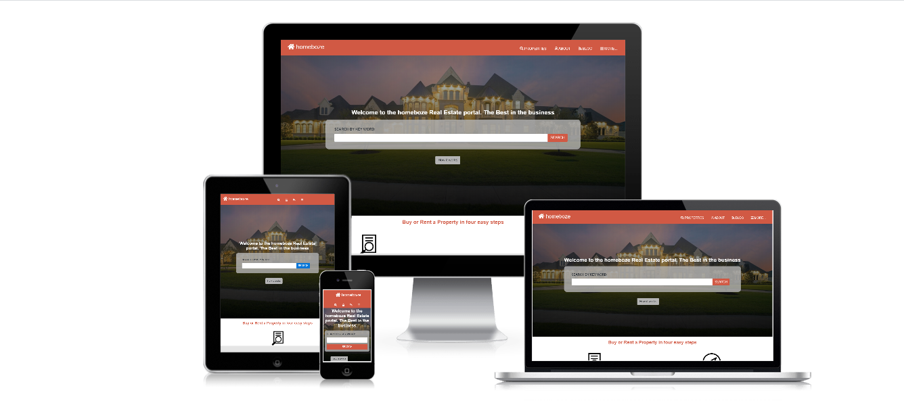

# HTML/CSS Capstone: Building homeboze (an online directory site for real estate)

> This project was developed as a learning project, part of the Microverse curriculum. This project is about building an
online directory for real estate properties. The goal was to build the page to be as identical in the somewhat vague
[specification](https://www.behance.net/gallery/25563385/PatashuleKE).



## Live demo

🔗 [Homeboze Website Clone]()

## Built With

- HTML5
- CSS3
- Font awesome
- Bootstrap 4
- Image source from [freepick.com](https://www.freepik.com/)


## Getting Started

To get a local copy up and running follow these simple example steps.

### Prerequisites

Web browser and access to internet

### Install

1) [Download](Clone the repository to your machine)

```sh
$ git clone https://github.com/belsman/Building-with-Responsive-Design/tree/develop
```

2) Navigate to the project folder and execute the "index.html" file.

### Usage

Just navigate through the page.

## Author

👤 **Bello Babakolo**

- Github: [@belsman](https://github.com/belsman)
- Twitter: [@d_belsman](https://twitter.com/d_belsman)
- Linkdin: [Bello Babakolo](https://www.linkedin.com/in/bello-babakolo-b23b17145/)


## 🤝 Contributing

Contributions, issues and feature requests are welcome!

Feel free to check the [issues page](issues/).

## Show your support

Give a ⭐️ if you like this project!

## Acknowledgments

- Microverse for showing the way for this project to happen
- [Mathew Njuguna and others on Behance](https://www.behance.net/mathewnjuguna)
